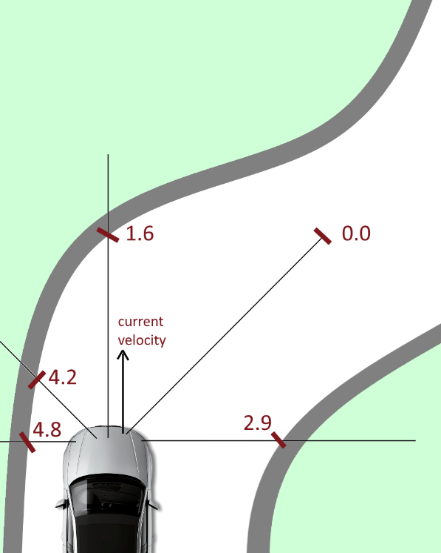

# Overview

> Please note: the project is archived. Documentation is lacking. File an issue if you need support.

This project uses a Particle Swarm Optimisation to to train the computer to control a vehicle (acceleration and steering) and navigate a race track as quick as possible. The project requires Unity for a 3D simulation and a C# ide.

# Project Concept

## Topic

Optimization of an artificial intelligence driven vehicle in a virtual driving simulator with the objective of minimizing time taken per lap of both racetracks used in training and unseen racetracks.

## Problem Summary

This project aims to use neural networks and evolutionary algorithms to optimize a vehicle controlled by artificial intelligence (AI). A series of racetracks will be presented to the vehicle. The output of the optimization will be to have an AI that can navigate the racetracks without crashing, and as fast as possible. Another output of this project is to have a game where a vehicle can be controlled by a human and compete with other vehicles controlled by the optimized AI. It should be almost impossible for the human driver to beat the AI in the training tracks, and the AI should hopefully still pose a reasonable challenge on &quot;unseen&quot; tracks.

## Hypothesis

Initially all vehicles will be assigned random weights to ensure that the initial population is a uniform representation of the entire search space. The genetic algorithm should achieve an absolute measure of fitness for the path the vehicle should travel.

Thereby, we can expect that over the generations, the cars will learn to:

1. Navigate the training track without crashing and be able to (at least partially) carry this auto-navigation ability over to unseen tracks.
2. To find the racing line of the training track that makes the vehicle complete the track in the shortest possible time.

## Proposed Methodology

The project will most likely comprise the following objectives/milestones:

- Set up a virtual driving simulator/environment using Unity.
- Experimentally figure out what spatial and environmental information regarding the vehicle will be useful as inputs into the driving controller&#39;s neural network, and how to capture them from the environment.
- Determine the best structure of the neural network for driving the cars (such as activation functions and outputs).
- Set up a genetic algorithm to find the optimal weights for the neural network:
  - Experimentally determine the best fitness function with which to evaluate the &quot;fitness&quot; of different neural networks&#39; performance. Possible factors to consider are: how far the individual made it around the track before crashing (further is better), then the time taken to cover that distance (shorter is better). The evaluation of an individual stops when the individual crashes (or possibly finishes a lap).
- Determine how to evolve the population as efficiently as possible – seeing as it will be an actual race in a 3D environment – it may take a long time per generation – especially once the evolution progresses.
- Depending on how quickly the team progresses through the initial stages of setup, and how effective/solid the evolutionary outcome is, there is a lot of flexibility regarding further exploration and experimentation on this topic.
 
 
Above: possible type of inputs to be fed into the neural network. Outputs could then translate to which parts of the car controller (such as accelerate, turn left,_ _turn right, or brake)_ _should be activated, deactivated,_ _or_ _remain_ _unchanged from previous state._
